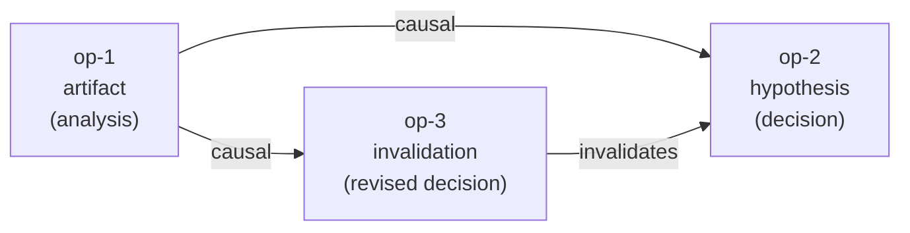

# History Graph Protocol (HGP)

**An MCP server that gives AI agents a permanent, append-only causal history.**

HGP records what an agent *did and why* — every operation, every causal link, and every piece of evidence behind each decision. Where memory systems (mem0, Zep, ChatGPT Memory) store what an agent *knows*, HGP stores what an agent *did*. Think of other memory systems as an agent's working memory; HGP is the agent's audit trail.

---

## Core Concepts

### Operations (Nodes)

Each operation is an immutable, typed, append-only record of an action taken by an agent. Four types:

| Type | Meaning |
|------|---------|
| `artifact` | A produced output (document, code, data) |
| `hypothesis` | A claim, decision, or inference |
| `merge` | Combining multiple prior operations |
| `invalidation` | Superseding or retracting a prior operation |

Operations are never deleted or mutated. The graph only grows.

### Causal Graph (DAG)

Operations are connected by directed edges:

- **`causal`** — A produced B (B depends on A)
- **`invalidates`** — A supersedes B (B is no longer current)

Example: an analysis produces a hypothesis, which is later revised by an invalidation.



### Memory Tier

Each operation carries a memory tier that reflects access recency:

| Tier | Meaning |
|------|---------|
| `short_term` | Recently active; included in all queries |
| `long_term` | Older but still reachable; included in all queries |
| `inactive` | Not accessed recently; excluded from default queries, never deleted |

Tiers are updated automatically based on access patterns and can be set manually via `hgp_set_memory_tier`.

### Evidence Trail (V3)

Operations can cite other operations as evidence, independently of the DAG edge structure. Evidence relations are stored separately and carry:

- **relation** — `supports`, `refutes`, `context`, `method`, or `source`
- **scope** — which aspect of the citing op this evidence applies to
- **inference** — free-text explanation of how the evidence was used

This allows full auditability: given any decision, you can reconstruct exactly what evidence it was based on and how each piece was interpreted.

---

## Installation

**Prerequisites:** Python ≥ 3.12, [uv](https://docs.astral.sh/uv/)

```bash
# With uv (recommended)
uv pip install hgp

# With pip
pip install hgp
```

**Run as MCP server (stdio transport):**

```bash
python -m hgp.server
```

### Environment Variables

| Variable | Default | Description |
|----------|---------|-------------|
| `HGP_DB_PATH` | `~/.hgp/hgp.db` | SQLite database path |
| `HGP_CAS_DIR` | `~/.hgp/.hgp_content/` | WORM content-addressable store directory |

### MCP Client Configuration

**Claude Code / Claude Desktop** (`claude_desktop_config.json` or `.claude/mcp.json`):

```json
{
  "mcpServers": {
    "hgp": {
      "command": "python",
      "args": ["-m", "hgp.server"],
      "env": {
        "HGP_DB_PATH": "/your/path/hgp.db"
      }
    }
  }
}
```

---

## Quick Start

> These are MCP tool calls — not direct Python imports. Invoke them through your MCP client (Claude Code, Claude Desktop, or any MCP-compatible host).

```text
# 1. Record an analysis operation (artifact)
hgp_create_operation(
    op_type="artifact",
    agent_id="agent-1",
    summary="Analyzed error rate spike in service logs",
    payload={"findings": "p99 latency exceeded 2s between 03:00-04:00 UTC"},
)
# → returns op_id: "op-abc123"

# 2. Record a decision (hypothesis) citing the analysis as evidence
hgp_create_operation(
    op_type="hypothesis",
    agent_id="agent-1",
    summary="Root cause is database connection pool exhaustion",
    parent_op_ids=["op-abc123"],
    evidence_refs=[
        {
            "op_id": "op-abc123",
            "relation": "supports",
            "scope": "latency correlation",
            "inference": "Latency spike aligns with connection pool saturation metrics",
        }
    ],
)
# → returns op_id: "op-def456"

# 3. Audit: what evidence did the decision cite?
hgp_get_evidence(op_id="op-def456")
# → lists all evidence records cited by op-def456

# 4. Audit: what decisions cited the original analysis?
hgp_get_citing_ops(op_id="op-abc123")
# → lists all ops that cited op-abc123 as evidence
```

---

## Tool Index

| Tool | Description |
|------|-------------|
| `hgp_create_operation` | Record a new operation; optionally attach payload, link parents, cite evidence |
| `hgp_query_operations` | Filter operations by type, agent, status, or memory tier |
| `hgp_query_subgraph` | Traverse ancestors or descendants from a root operation |
| `hgp_acquire_lease` | Acquire an optimistic lock on a subgraph before multi-step writes |
| `hgp_validate_lease` | Ping a lease to confirm it is still active (extends TTL by default) |
| `hgp_release_lease` | Release a lease explicitly after writing |
| `hgp_set_memory_tier` | Manually promote or demote an operation's memory tier |
| `hgp_get_artifact` | Retrieve binary payload from CAS by its object_hash |
| `hgp_anchor_git` | Link an operation to a Git commit SHA |
| `hgp_reconcile` | Run crash-recovery reconciler (use after unexpected shutdown) |
| `hgp_get_evidence` | List all operations a given op cited as evidence |
| `hgp_get_citing_ops` | Reverse lookup — list all ops that cited a given op as evidence |

→ Full API reference: [docs/tools-reference.md](docs/tools-reference.md)
→ Usage patterns and examples: [docs/usage-patterns.md](docs/usage-patterns.md)
