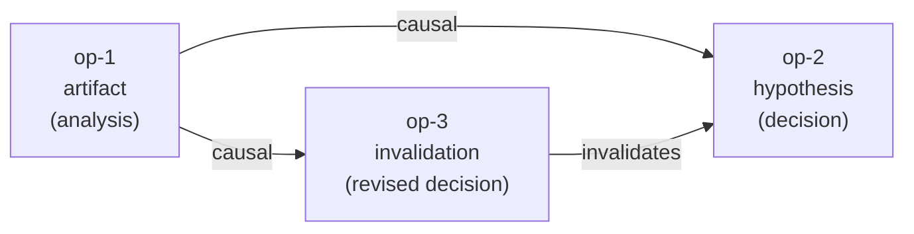

# History Graph Protocol (HGP)

**An MCP server that gives AI agents a permanent, append-only causal history.**

HGP records what an agent *did and why* — every file write, every decision, every piece of evidence behind each action. Where memory systems store what an agent *knows*, HGP stores what an agent *did*. Think of other memory systems as working memory; HGP is the audit trail.

---

## Why HGP?

| Without HGP | With HGP |
|---|---|
| Agent writes a file — no record of why | Every file write is a traceable artifact |
| Decision rationale lives only in context | Hypotheses and evidence are permanently stored |
| Can't tell what changed or when | Full causal graph: who did what, citing what |
| Session ends, history is gone | History persists across sessions and agents |

---

## Core Concepts

### Operations (Nodes)

Every action is an immutable, append-only record. Four types:

| Type | When to use |
|------|-------------|
| `artifact` | A produced output — file written, data generated |
| `hypothesis` | A decision, plan, or inference |
| `merge` | Combining multiple prior operations |
| `invalidation` | Superseding or retracting a prior operation |

Operations are never deleted or mutated. The graph only grows.

### Causal Graph (DAG)

Operations are connected by directed edges:

- **`causal`** — A produced B (B depends on A)
- **`invalidates`** — A supersedes B



### Memory Tier

Each operation has a memory tier that reflects access recency:

| Tier | Meaning |
|------|---------|
| `short_term` | Recently active; included in all queries |
| `long_term` | Older but still reachable; included in all queries |
| `inactive` | Not accessed recently; excluded from default queries, never deleted |

Tiers update automatically and can be set manually via `hgp_set_memory_tier`.

### Evidence Trail

Operations can cite other operations as evidence, independently of the DAG edge structure. Evidence relations carry:

- **relation** — `supports`, `refutes`, `context`, `method`, or `source`
- **scope** — which aspect of the citing op this evidence applies to
- **inference** — free-text explanation of how the evidence was used

Given any decision, you can reconstruct exactly what evidence it was based on and how each piece was interpreted.

---

## Installation

**Prerequisites:** Python ≥ 3.12, [uv](https://docs.astral.sh/uv/)

```bash
pip install history-graph-protocol
```

> The PyPI package is `history-graph-protocol`; the installed CLI command is `hgp`.

### One-command setup

```bash
hgp install
```

This registers HGP as an MCP server, installs hooks, and injects agent instructions — all in one step. Supports Claude Code, Gemini CLI, and Codex:

```bash
hgp install            # all supported clients (recommended)
hgp install --claude   # Claude Code only
hgp install --gemini   # Gemini CLI only
hgp install --codex    # Codex only
hgp install --local    # project-local scope instead of global
```

After running, restart your client and verify HGP tools are available.

### Manual setup

<details>
<summary>Configure without hgp install</summary>

**Claude Code:**

```bash
claude mcp add --scope user hgp -- python -m hgp.server
```

**Gemini CLI:**

```bash
gemini mcp add --scope user hgp python -m hgp.server
```

**Codex** — add to `.codex/config.toml`:

```toml
[mcp_servers.hgp]
command = "python"
args = ["-m", "hgp.server"]
```

> Use the Python that has `history-graph-protocol` installed. If using a virtual environment, replace `python` with the absolute path to the venv Python (e.g. `/path/to/.venv/bin/python`).

</details>

---

## Quick Start

> These are MCP tool calls — invoke them through your MCP client (Claude Code, Gemini CLI, or any MCP-compatible host).

```text
# Write a file and record it as an artifact
hgp_write_file(
    file_path="src/analysis.py",
    content="...",
    agent_id="claude-code",
    metadata={"description": "Initial analysis script"},
)
# → returns op_id: "op-abc123"

# Record the decision that led to a follow-up file
decision = hgp_create_operation(
    op_type="hypothesis",
    agent_id="claude-code",
    metadata={"description": "Refactor to use async based on profiling results"},
    parent_op_ids=["op-abc123"],
)

# Write the refactored file, linked to the decision
hgp_write_file(
    file_path="src/analysis.py",
    content="...",
    agent_id="claude-code",
    parent_op_ids=[decision["op_id"]],
)

# Later: audit what happened to a file
hgp_file_history(file_path="src/analysis.py")
# → all HGP operations recorded for this file, in order
```

---

## Tool Index

### File tools

| Tool | Description |
|------|-------------|
| `hgp_write_file` | Write (create or overwrite) a file and record it as an artifact |
| `hgp_append_file` | Append content to a file and record as artifact |
| `hgp_edit_file` | Replace a unique string in a file and record as artifact |
| `hgp_delete_file` | Delete a file and record an invalidation operation |
| `hgp_move_file` | Move/rename a file; records invalidation of old path + new artifact |
| `hgp_file_history` | Return all HGP operations recorded for a given file path |

### Graph tools

| Tool | Description |
|------|-------------|
| `hgp_create_operation` | Record a new operation; optionally attach payload, link parents, cite evidence |
| `hgp_query_operations` | Filter operations by type, agent, status, or memory tier |
| `hgp_query_subgraph` | Traverse ancestors or descendants from a root operation |
| `hgp_get_evidence` | List all operations a given op cited as evidence |
| `hgp_get_citing_ops` | Reverse lookup — list all ops that cited a given op as evidence |
| `hgp_get_artifact` | Retrieve binary payload from CAS by its `object_hash` |
| `hgp_anchor_git` | Link an operation to a Git commit SHA (requires full 40-char lowercase hex SHA) |
| `hgp_set_memory_tier` | Manually set an operation's memory tier (`short_term`, `long_term`, `inactive`) |

### Lease tools

Leases provide optimistic locking for multi-step write sequences.

| Tool | Description |
|------|-------------|
| `hgp_acquire_lease` | Acquire a lock on a subgraph before multi-step writes |
| `hgp_validate_lease` | Check a lease is still active; extends TTL by default |
| `hgp_release_lease` | Release a lease explicitly after writing |

### Maintenance

| Tool | Description |
|------|-------------|
| `hgp_reconcile` | Run crash-recovery reconciler (use after unexpected shutdown) |

> **Token-sensitive sessions:** mutation tools accept `verbose=False` to omit `chain_hash` and `object_hash` from responses, reducing per-call token overhead by ~73%. Default is `verbose=True`.

→ Full API reference: [docs/tools-reference.md](docs/tools-reference.md)  
→ Usage patterns and examples: [docs/usage-patterns.md](docs/usage-patterns.md)

---

## Configuration

### HGP mode

Control whether HGP records operations. Mode is stored in `<repo_root>/.hgp/mode`. Agents are blocked from changing it via the `hgp mode` Bash command — the pre-Bash hook intercepts and rejects those calls.

```bash
hgp mode              # show current mode (default: on)
hgp mode on           # normal operation
hgp mode advisory     # mutation tools return HGP_ADVISORY instead of recording
hgp mode off          # all tools return HGP_DISABLED
```

| Mode | Mutation tools | Query tools |
|------|---------------|-------------|
| `on` | execute normally | execute normally |
| `advisory` | return `{"status": "HGP_ADVISORY"}` | execute normally |
| `off` | return `{"status": "HGP_DISABLED"}` | return `{"status": "HGP_DISABLED"}` |

### Hook enforcement policy

Hooks warn (or block) when native file tools are used instead of HGP equivalents.

```bash
hgp hook-policy              # show current policy (default: advisory)
hgp hook-policy advisory     # warn only — native file tools still allowed
hgp hook-policy block        # block native Write/Edit/MultiEdit/write_file/replace
```

> If you installed hooks before this feature was added, run `hgp install` again to update them.

### Storage

HGP stores its database and content-addressable blobs in `<repo_root>/.hgp/` (gitignored). The server resolves the project root from the nearest `.git` directory at startup.

- **Graph tools** (`hgp_create_operation`, queries, etc.): if no git repo is found, fall back to `<cwd>/.hgp/` with a warning.
- **File tools** (`hgp_write_file`, `hgp_edit_file`, etc.): always require a git repo or an explicit `HGP_PROJECT_ROOT`. Without one, they return `PROJECT_ROOT_NOT_FOUND`.

The `.hgp/` directory is reserved for HGP internals. File tools reject any path that contains a `.hgp` directory segment — including nested paths like `sub/.hgp/file.txt` — and return `HGP_INTERNAL_PATH`. This applies across all `.hgp/` directories in a project tree, which is intentional for monorepo and nested-repo layouts.

One server process is bound to one store.

### Environment variables

| Variable | Default | Description |
|----------|---------|-------------|
| `HGP_PROJECT_ROOT` | _(auto)_ | Override project root (default: nearest `.git` from cwd, then `cwd`) |
| `HGP_HOOK_BLOCK` | `0` | Set to `1` to block native file tool calls instead of warning |

---

## Run as MCP server

```bash
hgp
# or
python -m hgp.server
```

HGP uses stdio transport and is compatible with any MCP-compliant host.
