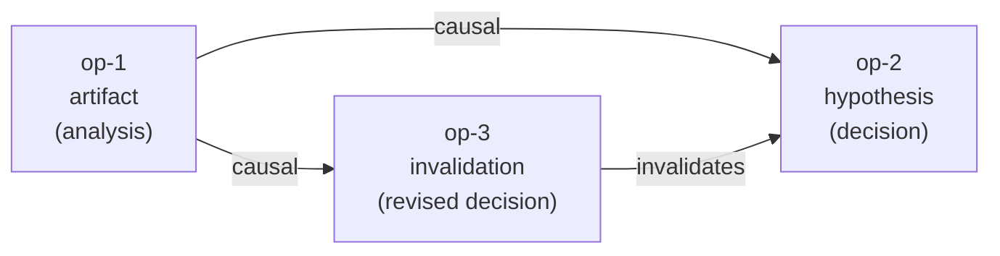

# History Graph Protocol (HGP)

**An MCP server that gives AI agents a permanent, append-only causal history.**

HGP records what an agent *did and why* — every operation, every causal link, and every piece of evidence behind each decision. Where memory systems (mem0, Zep, ChatGPT Memory) store what an agent *knows*, HGP stores what an agent *did*. Think of other memory systems as an agent's working memory; HGP is the agent's audit trail.

---

## Core Concepts

### Operations (Nodes)

Each operation is an immutable, typed, append-only record of an action taken by an agent. Four types:

| Type | Meaning |
|------|---------|
| `artifact` | A produced output (document, code, data) |
| `hypothesis` | A claim, decision, or inference |
| `merge` | Combining multiple prior operations |
| `invalidation` | Superseding or retracting a prior operation |

Operations are never deleted or mutated. The graph only grows.

### Causal Graph (DAG)

Operations are connected by directed edges:

- **`causal`** — A produced B (B depends on A)
- **`invalidates`** — A supersedes B (B is no longer current)

Example: an analysis produces a hypothesis, which is later revised by an invalidation.



### Memory Tier

Each operation carries a memory tier that reflects access recency:

| Tier | Meaning |
|------|---------|
| `short_term` | Recently active; included in all queries |
| `long_term` | Older but still reachable; included in all queries |
| `inactive` | Not accessed recently; excluded from default queries, never deleted |

Tiers are updated automatically based on access patterns and can be set manually via `hgp_set_memory_tier`. Valid tier values: `short_term`, `long_term`, `inactive`. See [docs/tools-reference.md](docs/tools-reference.md#hgp_set_memory_tier) for details.

### Evidence Trail (V3)

Operations can cite other operations as evidence, independently of the DAG edge structure. Evidence relations are stored separately and carry:

- **relation** — `supports`, `refutes`, `context`, `method`, or `source`
- **scope** — which aspect of the citing op this evidence applies to
- **inference** — free-text explanation of how the evidence was used

This allows full auditability: given any decision, you can reconstruct exactly what evidence it was based on and how each piece was interpreted.

---

## Installation

**Prerequisites:** Python ≥ 3.12, [uv](https://docs.astral.sh/uv/)

```bash
# With uv (recommended)
uv pip install history-graph-protocol

# With pip
pip install history-graph-protocol
```

> **Note:** The PyPI package name is `history-graph-protocol`; the installed CLI command is `hgp`.

**Run as MCP server (stdio transport):**

```bash
hgp
# or
python -m hgp.server
```

### MCP Client Configuration

Use `hgp install` to register HGP as an MCP server, install hooks, and inject agent instructions in one step:

```bash
hgp install            # Claude Code + Gemini CLI + Codex (global, recommended)
hgp install --claude   # Claude Code only
hgp install --gemini   # Gemini CLI only
hgp install --codex    # Codex only
hgp install --local    # project-local scope instead of global
```

`hgp install` performs three steps per client:

1. **MCP registration** — registers HGP as an MCP server via the client CLI
2. **Hooks** — copies hook scripts and wires them into the client's settings
3. **Agent instructions** — appends the HGP usage block to `CLAUDE.md` / `GEMINI.md` / `AGENTS.md`

Or configure manually:

**Claude Code:**

```bash
claude mcp add --scope user hgp -- python -m hgp.server
```

**Gemini CLI:**

```bash
gemini mcp add --scope user hgp python -m hgp.server
```

**Codex (project-local):** add to `.codex/config.toml`:

```toml
[mcp_servers.hgp]
command = "python"
args = ["-m", "hgp.server"]
```

> Use the python that has `history-graph-protocol` installed. If using a virtual
> environment, replace `python` with the absolute path to the venv python
> (e.g. `/path/to/.venv/bin/python`).

After registering, restart the client and verify HGP tools are available.

### Hook enforcement policy

By default, hooks warn when native file tools are used instead of HGP equivalents. You can change this persistently with:

```bash
hgp hook-policy              # show current policy (default: advisory)
hgp hook-policy advisory     # warn only — native file tools allowed
hgp hook-policy block        # block native Write/Edit/write_file/replace
```

The policy is stored in `<repo_root>/.hgp/hook-policy`. The `HGP_HOOK_BLOCK` environment variable takes precedence over the file if set.

> **Note:** If you installed hooks before this feature was added, run `hgp install` again to update them.

### Storage

HGP stores its database and content-addressable blobs in `<repo_root>/.hgp/` (gitignored). The server resolves the project root from the working directory at startup — it is bound to one repository per process.

### Environment Variables

| Variable | Default | Description |
|----------|---------|-------------|
| `HGP_PROJECT_ROOT` | _(auto)_ | Override project root (default: nearest `.git` from cwd, or `~/.hgp/` if not in a repo) |
| `HGP_GLOBAL_MODE` | _(unset)_ | Set to `1` to force legacy global store at `~/.hgp/` (all projects share one DB) |
| `HGP_HOOK_BLOCK` | `0` | Set to `1` to block native file tool calls (Write/Edit) instead of warning |

---

## Quick Start

> These are MCP tool calls — not direct Python imports. Invoke them through your MCP client (Claude Code, Claude Desktop, or any MCP-compatible host).

```text
# 1. Record an analysis operation (artifact)
hgp_create_operation(
    op_type="artifact",
    agent_id="agent-1",
    metadata={
        "description": "Analyzed error rate spike in service logs",
        "findings": "p99 latency exceeded 2s between 03:00-04:00 UTC",
    },
)
# → returns op_id: "op-abc123"

# 2. Record a decision (hypothesis) citing the analysis as evidence
hgp_create_operation(
    op_type="hypothesis",
    agent_id="agent-1",
    metadata={"description": "Root cause is database connection pool exhaustion"},
    parent_op_ids=["op-abc123"],
    evidence_refs=[
        {
            "op_id": "op-abc123",
            "relation": "supports",
            "scope": "latency correlation",
            "inference": "Latency spike aligns with connection pool saturation metrics",
        }
    ],
)
# → returns op_id: "op-def456"

# 3. Audit: what evidence did the decision cite?
hgp_get_evidence(op_id="op-def456")
# → lists all evidence records cited by op-def456

# 4. Audit: what decisions cited the original analysis?
hgp_get_citing_ops(op_id="op-abc123")
# → lists all ops that cited op-abc123 as evidence
```

---

## Tool Index

| Tool | Description |
|------|-------------|
| `hgp_create_operation` | Record a new operation; optionally attach payload, link parents, cite evidence |
| `hgp_query_operations` | Filter operations by type, agent, status, or memory tier |
| `hgp_query_subgraph` | Traverse ancestors or descendants from a root operation |
| `hgp_acquire_lease` | Acquire an optimistic lock on a subgraph before multi-step writes |
| `hgp_validate_lease` | Ping a lease to confirm it is still active (extends TTL by default) |
| `hgp_release_lease` | Release a lease explicitly after writing |
| `hgp_set_memory_tier` | Manually promote or demote an operation's memory tier |
| `hgp_get_artifact` | Retrieve binary payload from CAS by its object_hash |
| `hgp_anchor_git` | Link an operation to a Git commit SHA (requires full 40-char lowercase hex SHA) |
| `hgp_reconcile` | Run crash-recovery reconciler (use after unexpected shutdown) |
| `hgp_get_evidence` | List all operations a given op cited as evidence |
| `hgp_get_citing_ops` | Reverse lookup — list all ops that cited a given op as evidence |
| `hgp_write_file` | Write (create or overwrite) a file and record it as an artifact |
| `hgp_append_file` | Append content to a file and record as artifact |
| `hgp_edit_file` | Replace a unique string in a file and record as artifact |
| `hgp_delete_file` | Delete a file and record an invalidation operation |
| `hgp_move_file` | Move/rename a file; records invalidation of old path + new artifact |
| `hgp_file_history` | Return all HGP operations recorded for a given file path |

→ Full API reference: [docs/tools-reference.md](docs/tools-reference.md)
→ Usage patterns and examples: [docs/usage-patterns.md](docs/usage-patterns.md)

> **Token-sensitive sessions:** mutation tools (`hgp_create_operation`, `hgp_write_file`, `hgp_edit_file`, `hgp_append_file`, `hgp_delete_file`, `hgp_move_file`) accept `verbose=False` to omit `chain_hash` and `object_hash` from responses, reducing per-call token overhead by ~73%. The default is `verbose=True`.
