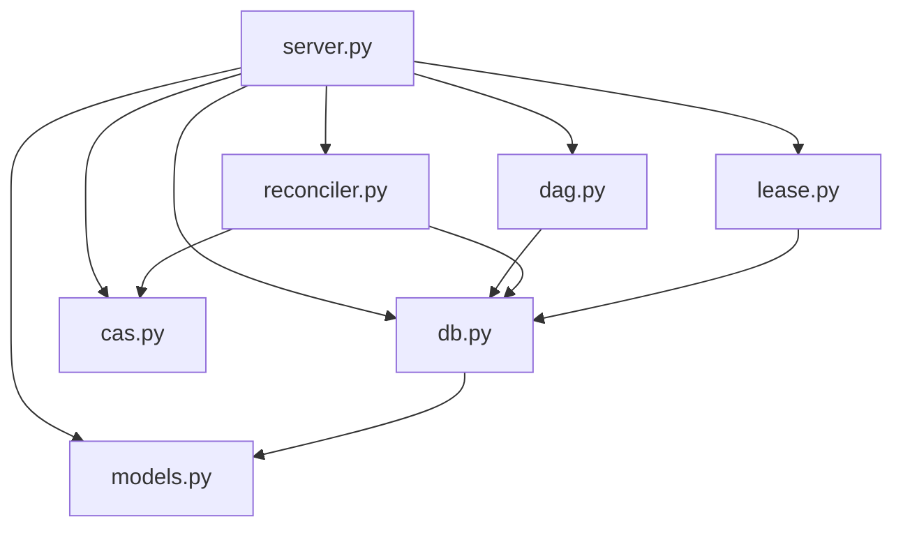

# HGP Architecture

This document is the internal reference for contributors. It describes how HGP's modules
fit together, what each database table holds, and why key design decisions were made.
Assume familiarity with Python and SQLite; no prior HGP context is required.

---

## 1. Module Overview



**`models.py`** — Pydantic v2 data models and enumerations (`OpType`, `OpStatus`,
`EdgeType`, `LeaseStatus`, `MemoryTier`, `EvidenceRelation`, etc.). No business logic.
All other modules import from here; `models.py` imports nothing internal.

**`db.py`** — Thread-safe SQLite wrapper (`Database`). Owns the full schema DDL, all
parameterised queries, the write-lock helpers (`begin_immediate`, `begin_deferred`,
`commit`, `rollback`), and the memory-tier bookkeeping methods (`record_access`,
`demote_inactive`, `expire_leases`). All SQL is centralised here; no other module
issues raw SQL directly.

**`dag.py`** — DAG traversal and `chain_hash` computation. Implements four recursive
CTE queries (ancestor/descendant × unbounded/depth-bounded) and
`compute_chain_hash()`, which derives a SHA-256 digest from the reachable subgraph.
Depends only on `db.py`.

**`cas.py`** — Content-Addressable Storage (`CAS`). A WORM blob store backed by the
local filesystem. `store()` writes to a `.staging/` directory first, then performs an
atomic `os.rename()` into the final two-level shard layout (`<hex[:2]>/<hex[2:]>`).
`read()` and `exists()` are pure filesystem lookups. No database interaction.

**`lease.py`** — `LeaseManager`. Issues time-bounded lease tokens that bind an agent
to a specific subgraph's `chain_hash` at the moment of acquisition. `validate()` does
a double-check pattern: a fast pre-read outside the write lock followed by a
re-validation inside `BEGIN IMMEDIATE`, closing the TOCTOU window.

**`reconciler.py`** — `Reconciler`. Runs four deterministic consistency rules on
demand or at startup: marks operations with missing CAS blobs as `MISSING_BLOB`,
marks unreferenced CAS blobs as `ORPHAN_CANDIDATE`, cleans stale staging files, and
demotes unaccessed operations to the `inactive` tier.

**`server.py`** — MCP/HTTP entry point. Orchestrates all other modules: validates
incoming requests, opens `BEGIN IMMEDIATE` transactions for writes, delegates
computation to `dag.py` and `lease.py`, and wraps `record_access()` calls in a
best-effort try/except so evidence lookups never fail the caller due to a transient
write-lock contention.

---

## 2. Database Schema

The full DDL is in `src/hgp/db.py:15-115`. Schema is applied via `executescript()` at
startup (`Database.initialize()`), which is idempotent (`CREATE TABLE IF NOT EXISTS`).
V2 memory-tier columns are applied via `ALTER TABLE` migration guards
(`src/hgp/db.py:142-151`).

### `operations`

The central table. One row per logical operation submitted by an agent.

| Column | Type | Notes |
|---|---|---|
| `op_id` | TEXT PK | UUID supplied by caller |
| `op_type` | TEXT | `artifact`, `hypothesis`, `merge`, `invalidation` |
| `status` | TEXT | `PENDING`, `COMPLETED`, `INVALIDATED`, `MISSING_BLOB` |
| `commit_seq` | INTEGER UNIQUE | Monotonically increasing sequence; `NULL` until committed |
| `agent_id` | TEXT | Owning agent identifier |
| `object_hash` | TEXT FK→objects | `sha256:<hex>` reference to a CAS blob; nullable |
| `chain_hash` | TEXT | SHA-256 digest of the reachable subgraph at commit time |
| `metadata` | TEXT | JSON freeform payload |
| `created_at` / `completed_at` | TEXT | ISO-8601 UTC timestamps |
| `access_count` | REAL | Decayed float counter incremented by `record_access()` |
| `last_accessed` | TEXT | Updated only when access weight ≥ 0.4 |
| `memory_tier` | TEXT | `short_term`, `long_term`, `inactive` |

Indexes: `agent_id`, `op_type`, `status`, `commit_seq`.

### `op_edges`

Directed edges of the causal DAG.

| Column | Type | Notes |
|---|---|---|
| `child_op_id` | TEXT FK→operations | The later (dependent) operation |
| `parent_op_id` | TEXT FK→operations | The earlier (dependency) operation |
| `edge_type` | TEXT | `causal` or `invalidates` |

Primary key is `(child_op_id, parent_op_id)`, preventing duplicate edges. Indexes on
both `child_op_id` and `parent_op_id` support bidirectional traversal. **Only edges
representing causal succession or invalidation belong here.** Evidence citations are
stored separately (see Section 6).

### `objects` (CAS registry)

One row per content-addressed blob known to the system. Acts as a registry that the
`operations.object_hash` foreign key references.

| Column | Type | Notes |
|---|---|---|
| `hash` | TEXT PK | `sha256:<hex>` |
| `size` | INTEGER | Byte count (0 when inserted as a FK placeholder) |
| `mime_type` | TEXT | Optional MIME type |
| `status` | TEXT | `VALID`, `MISSING_BLOB`, `ORPHAN_CANDIDATE` |
| `created_at` | TEXT | ISO-8601 UTC |
| `gc_marked_at` | TEXT | Set when the reconciler marks the row as orphaned |

Rows are inserted before the corresponding `operations` row to satisfy the foreign key
constraint (`src/hgp/db.py:186-191`, `INSERT OR IGNORE`). No deletion is ever
performed; orphans are only flagged.

### `leases`

Time-bounded tokens binding an agent to a subgraph's `chain_hash`.

| Column | Type | Notes |
|---|---|---|
| `lease_id` | TEXT PK | UUID |
| `agent_id` | TEXT | Issuing agent |
| `subgraph_root_op_id` | TEXT FK→operations | Root of the locked subgraph |
| `chain_hash` | TEXT | Hash snapshot at acquisition time |
| `issued_at` / `expires_at` | TEXT | ISO-8601 UTC |
| `status` | TEXT | `ACTIVE`, `EXPIRED`, `RELEASED` |

Indexes on `agent_id` and `status`. When a new lease is acquired for the same
`(agent_id, subgraph_root_op_id)` pair, any prior `ACTIVE` lease is auto-released
(`src/hgp/lease.py:29-35`).

### `commit_counter`

A single-row monotonic counter.

| Column | Type | Notes |
|---|---|---|
| `id` | INTEGER PK | Always `1` (enforced by CHECK) |
| `next_seq` | INTEGER | Next value to assign; starts at `1` |

`Database.next_commit_seq()` increments then reads `next_seq - 1` inside the caller's
`BEGIN IMMEDIATE` transaction, guaranteeing uniqueness without a separate SELECT lock.

### `git_anchors`

Optional linkage between HGP operations and Git commits.

| Column | Type | Notes |
|---|---|---|
| `op_id` | TEXT FK→operations | HGP operation |
| `git_commit_sha` | TEXT | Exactly 40 hex characters (CHECK constraint) |
| `repository` | TEXT | Optional repository URL or name |
| `created_at` | TEXT | ISO-8601 UTC |

Primary key is `(op_id, git_commit_sha)`. There is no index beyond the PK; lookup
is expected to go op→git, not the reverse.

### `op_evidence` (V3)

Non-causal reference links from one operation to another. Added in V3.

| Column | Type | Notes |
|---|---|---|
| `id` | INTEGER PK AUTOINCREMENT | Surrogate key |
| `citing_op_id` | TEXT FK→operations | Operation that cites evidence |
| `cited_op_id` | TEXT FK→operations | Operation being cited |
| `relation` | TEXT | `supports`, `refutes`, `context`, `method`, `source` |
| `scope` | TEXT | Optional focus description (≤ 1024 chars) |
| `inference` | TEXT | Optional reasoning note (≤ 4096 chars) |
| `created_at` | TEXT | ISO-8601 UTC |

`UNIQUE(citing_op_id, cited_op_id)` prevents duplicate citations. Self-reference is
rejected at the application layer (`src/hgp/db.py:388-389`). A cap of 200 rows per
query prevents reverse fan-out DoS (`_MAX_EVIDENCE_RESULTS`, `src/hgp/db.py:119`).
Indexes on both `citing_op_id` and `cited_op_id`.

---

## 3. SQLite Concurrency Model

### Autocommit mode

The connection is opened with `isolation_level=None`
(`src/hgp/db.py:134-136`). In CPython's `sqlite3` module, any other value causes the
driver to auto-issue `BEGIN DEFERRED` before DML, which conflicts with explicit
`BEGIN IMMEDIATE` statements. Autocommit mode means every statement commits
immediately unless the caller has explicitly opened a transaction.

### `BEGIN IMMEDIATE` for writes

All write paths call `db.begin_immediate()` before touching any rows. `BEGIN IMMEDIATE`
acquires a reserved lock upfront, blocking any concurrent writer from entering the
transaction at all. This closes the check-then-act TOCTOU window: once inside the
transaction, the data the writer read is guaranteed to still match what it is about to
write.

### `BEGIN DEFERRED` for read-only snapshots

`db.begin_deferred()` is used when the caller needs a consistent snapshot of multiple
rows without acquiring a write lock. Deferred transactions do not block concurrent
readers and only escalate to a write lock if DML is issued inside them.

### WAL mode

`PRAGMA journal_mode = WAL` is set in the schema script (`src/hgp/db.py:16`). WAL
allows readers to see a stable snapshot of the database while a writer is appending to
the write-ahead log. This is what makes concurrent reads safe alongside `BEGIN
IMMEDIATE` write transactions.

### `PRAGMA busy_timeout = 5000`

Set in the schema script (`src/hgp/db.py:19`). When a `BEGIN IMMEDIATE` call cannot
acquire the write lock because another writer holds it, SQLite retries internally for up
to 5000 ms before returning `SQLITE_BUSY`. The application does not need a manual retry
loop.

### `commit()` / `rollback()` helpers

Both helpers catch `sqlite3.OperationalError` with the message `"no transaction"` and
suppress it (`src/hgp/db.py:215-233`). This is safe in autocommit mode: if a code path
calls `commit()` when no transaction is open (e.g. after a query-only path), the call
is a no-op. Real I/O failures (`SQLITE_FULL`, `SQLITE_IOERR`) carry different messages
and are re-raised.

---

## 4. Memory Tier System

Operations have a `memory_tier` column with three possible values.

### Tiers

| Tier | Meaning |
|---|---|
| `short_term` | Currently leased, or recently promoted by access |
| `long_term` | Default tier; included in queries unless explicitly excluded |
| `inactive` | Not accessed within the project-relative threshold; excluded from default queries |

`query_operations()` filters `memory_tier != 'inactive'` unless `include_inactive=True`
is passed (`src/hgp/db.py:267-268`). Results are ordered: `short_term` first,
`long_term` second, `inactive` last (`src/hgp/db.py:270-275`).

### Access recording and tier promotion

`Database.record_access(op_id, weight)` increments `access_count` by `weight`.
For `weight >= 0.4` (i.e., access depths 0–2), it also updates `last_accessed` to now
and promotes `inactive` operations back to `long_term` (`src/hgp/db.py:307-324`).
Deeper ancestors (weight < 0.4) accumulate count-only without changing tier or
timestamp, preventing spurious promotions from background traversal noise.

In `server.py`, calls to `record_access()` are wrapped in a best-effort block
(`_record_access_with_decay()`). A `sqlite3.OperationalError` from write-lock
contention is caught and logged but never propagates to the caller, so a read request
cannot fail because a concurrent writer holds `BEGIN IMMEDIATE`.

### Tier demotion

The reconciler calls `Database.demote_inactive(threshold_days=30)`
(`src/hgp/reconciler.py:68`). This uses a *project-pulse* baseline: the maximum
`COALESCE(last_accessed, created_at)` across all operations (`src/hgp/db.py:339-344`).
Any `long_term` operation whose last access is more than 30 Julian days behind the
project pulse is moved to `inactive`. Using a relative baseline means demotion is
project-activity-aware: a project that has been idle for months will not demote
everything the moment reconcile runs.

`ReconcileReport.demoted_to_inactive` records the count of demoted rows.

Lease expiry also triggers tier adjustment: `Database.expire_leases()` moves
`short_term` operations back to `long_term` when they have no remaining `ACTIVE` lease
(`src/hgp/db.py:354-375`).

---

## 5. Content-Addressable Store (CAS)

`CAS` (`src/hgp/cas.py`) stores binary blobs on disk, addressed by their SHA-256
digest. The key invariant is **WORM** (Write Once, Read Many): once a blob is stored
under a given hash, its content never changes and is never deleted by normal operation.

### Hash format

All hashes are formatted as `sha256:<64-hex-chars>`. The regex
`^sha256:[0-9a-f]{64}$` is enforced on every read and hash-to-path conversion
(`src/hgp/cas.py:15`, `src/hgp/cas.py:97-98`).

### On-disk layout

Blobs are stored in a two-level shard layout under `content_dir`:

```
content_dir/
  ab/                      ← first 2 hex chars of hash
    cdef...62-char-suffix  ← remaining 62 chars
  .staging/
    <uuid>.tmp             ← in-flight writes
```

### Five-step crash-safe write path (`CAS.store`)

1. **Compute hash** — SHA-256 of the payload. If the final path already exists, return
   immediately (idempotent fast path).
2. **Write to staging** — Write to a UUID-named `.tmp` file under `.staging/`, then
   `fsync` the file descriptor before closing it.
3. **Atomic rename** — `os.rename(staging_path, final_path)`. On POSIX, this is
   atomic at the filesystem level. If the rename fails because another concurrent writer
   already placed the same hash (race on the same content), the staging file is removed
   and the function returns successfully.
4. **fsync directories** — Both `.staging/` and the shard directory (`final_dir`) are
   fsynced to ensure the directory entry is durable before the function returns.
5. **Return hash** — The caller receives `sha256:<hex>`.

If a crash occurs between steps 2 and 3, a stale `.tmp` file is left in `.staging/`.
The reconciler cleans these up after the `ORPHAN_GRACE_PERIOD` (15 minutes)
(`src/hgp/reconciler.py:51-64`).

### No deletion

The reconciler marks unreferenced blobs as `ORPHAN_CANDIDATE` in the `objects` table
but never calls `unlink()` on them. Actual removal is a manual operator decision.

---

## 6. Evidence Trail vs. Causal Graph (Design Decision)

This section explains why `op_evidence` is a separate table from `op_edges`, and why
that separation must be preserved.

### The two graphs

**`op_edges`** is the causal DAG. An edge `(child, parent)` asserts that `child` was
produced from `parent`. The DAG has two edge types:

- `causal` — `parent` produced `child` (temporal succession, data lineage)
- `invalidates` — `child` supersedes `parent` (the parent's conclusion is withdrawn)

**`op_evidence`** is a non-causal reference layer. An evidence row `(citing, cited)`
asserts that `citing` was *informed by* `cited`, but makes no claim about temporal
order or parent-child hierarchy. An agent may cite evidence from an entirely different
lineage, from a future operation (retroactively), or from any arbitrary op in the graph.

### Why they must stay separate

**`chain_hash` integrity.** `compute_chain_hash()` (`src/hgp/dag.py:115-134`) hashes
the set of nodes and edges reachable via `op_edges` from a given root. If evidence
citations lived in `op_edges`, every time an operation cited another as evidence, it
would change the `chain_hash` of every subgraph that includes the citing op. This would:

- Invalidate all active leases whose `chain_hash` was computed before the citation was
  added.
- Make `chain_hash` non-deterministic with respect to the causal structure: two
  logically identical causal graphs could have different hashes depending on who cited
  what evidence.

**Semantic correctness.** `op_edges` encodes *production* relationships. A CTE ancestor
traversal answers "what operations was this result derived from?" Evidence citations
answer "what existing knowledge informed this operation?" These are orthogonal
questions. Collapsing them into one table would contaminate ancestor queries with
non-causal links.

**Traversal correctness.** `dag.py` CTEs recurse over `op_edges`. If evidence rows were
mixed in, traversal would follow evidence links as if they were causal ancestors,
producing incorrect subgraph membership and incorrect `chain_hash` values.

### The three relationship categories

```
causal      → op_edges (edge_type = 'causal')       A produced B
invalidates → op_edges (edge_type = 'invalidates')   A supersedes B
evidence    → op_evidence                            B was informed by A
```

The first two encode *what happened*. The third encodes *why it was believed*.

---

## 7. `chain_hash`

### What it is

`chain_hash` is a `sha256:<hex>` digest over the entire reachable subgraph anchored at
a given operation. The canonical input to the hash is:

```
OPS[<op_id>:<status>:<commit_seq>|...]EDGES[<child>><parent>:<edge_type>|...]
```

Both the op list and the edge list are sorted deterministically (`ORDER BY op_id` and
`ORDER BY child_op_id, parent_op_id`) so the same subgraph always produces the same
hash regardless of insertion order (`src/hgp/dag.py:121-134`).

Traversal is depth-bounded at `MAX_CHAIN_HASH_DEPTH = 500` (`src/hgp/dag.py:112`) to
prevent a DoS where a deeply-chained DAG causes unbounded recursion in the SQLite CTE.
Edges are then filtered to include only those where both endpoints fall within the
depth-bounded ancestor set, keeping the hash consistent with the bounded node set.

### Where it is stored

`operations.chain_hash` stores the hash for the subgraph rooted at that operation, as
computed at commit time. It is stored for auditing and for lease acquisition; it is not
recomputed on every read.

The `leases.chain_hash` column stores the hash snapshot at lease acquisition time.
This is the value compared against the live-computed hash during `validate()`.

### TOCTOU defence in `LeaseManager.validate()`

Lease validation uses a two-phase check (`src/hgp/lease.py:66-126`):

1. **Pre-flight read** (outside any lock) — Rejects obviously invalid leases (not
   found, wrong status, already expired) without acquiring the write lock, reducing
   contention.
2. **Authoritative check inside `BEGIN IMMEDIATE`** — Re-fetches the lease row under
   the write lock, re-evaluates expiry, and then calls `compute_chain_hash()` against
   the live DAG. If the hash differs from what was stored at acquisition, `CHAIN_STALE`
   is returned and the lock is released.

This two-phase pattern means that even if two agents race to validate and write against
the same subgraph, only one can hold `BEGIN IMMEDIATE` at a time. The second writer
will compute a divergent hash (because the first writer's commit changed op statuses
or added edges) and be rejected with `CHAIN_STALE` before it can commit.

### Why `chain_hash` prevents split-brain

If two agents independently read a subgraph, compute a `chain_hash`, and attempt
concurrent writes that modify the same subgraph:

- Both start with identical hashes at the moment of their respective lease acquisitions.
- Writer A commits first (inside `BEGIN IMMEDIATE`), changing `commit_seq` values or
  adding edges.
- Writer B's `compute_chain_hash()`, called inside its own `BEGIN IMMEDIATE`, will now
  include Writer A's changes and produce a different hash.
- The hash diverges from the one stored in B's lease → `CHAIN_STALE` → B's write is
  rejected.

The subgraph is therefore linearised through the write lock + hash comparison, even
though SQLite itself does not provide serialisable snapshot isolation at the
application level.

---

## V4: File Tracking

### Project Root Scoping

All V4 file tools operate within a project root. The root is determined by:

1. **`HGP_PROJECT_ROOT` environment variable** — If set to a valid directory path, this overrides automatic detection. Useful in test environments or when the project root cannot be inferred from the file path.

2. **`.git` directory traversal** — Starting from the file path's parent directory, HGP walks up the directory tree until it finds a `.git` directory. The directory containing `.git` becomes the project root.

If neither resolves, the tool returns `{"error": "PROJECT_ROOT_NOT_FOUND"}`.

All file paths are validated with `Path.resolve().relative_to(root)` before any I/O. Paths outside the root return `{"error": "PATH_OUTSIDE_ROOT"}`.

**New module:** `src/hgp/project.py` — `find_project_root()` and `assert_within_root()`.

### Enforcement Model

V4 uses a three-layer strategy to encourage agents to use `hgp_*` tools instead of native CLI tools:

| Layer | Mechanism | Scope | Hard-blocks? |
|-------|-----------|-------|--------------|
| 1 | Instruction files (`CLAUDE.md`, `AGENTS.md`, `GEMINI.md`) | All CLI agents | No — advisory only |
| 2 | Claude Code `PreToolUse` hook (`.claude/hooks/pre_tool_use_hgp.py`) | Claude Code only | No by default; yes with `HGP_HOOK_BLOCK=1` |
| 3 | Agent discipline | All agents | N/A |

**Known limitations:**
- Native tool bypass — agents using Write/Edit/Bash directly bypass V4 recording
- External process changes (git, cp, mv, shell scripts) are not tracked
- Non-Claude CLI agents have no hook equivalent; only instruction files apply
- Binary files are out of scope (future work)

### Git + HGP Consistency

V4 removes `*.db` from `.gitignore`. The HGP database is committed to git alongside project files. This provides:

- **Consistent restore** — `git restore` or `git checkout` on a previous commit restores both code and the HGP history that corresponds to that code
- **Branch isolation** — Each git branch carries its own HGP history
- **No orphaned history** — Deleting a branch removes its history too

**WAL/SHM files** (`.db-wal`, `.db-shm`) remain in `.gitignore` because they are SQLite lock files that are meaningless outside an active connection.

The `hgp_reconcile` tool handles crash-recovery for the case where the DB is in an inconsistent state after an unexpected shutdown.
