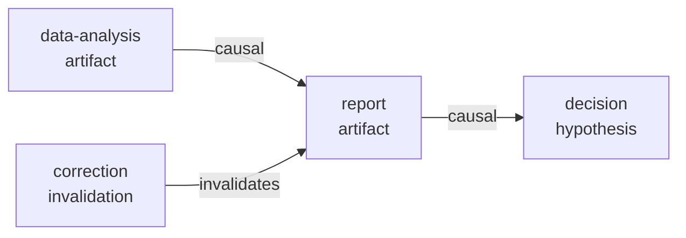
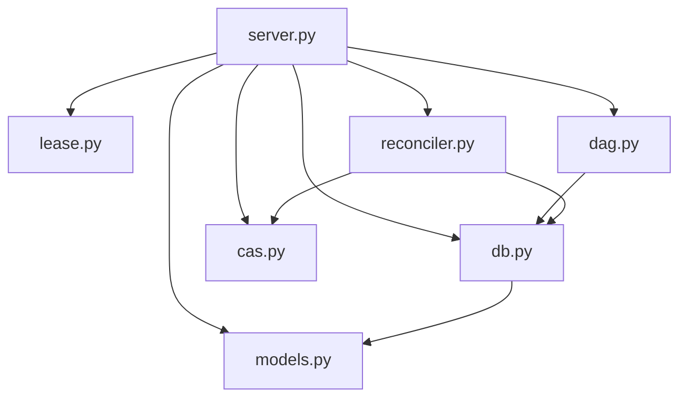

# HGP Documentation Implementation Plan

> **For agentic workers:** REQUIRED SUB-SKILL: Use superpowers:subagent-driven-development (recommended) or superpowers:executing-plans to implement this plan task-by-task. Steps use checkbox (`- [ ]`) syntax for tracking.

**Goal:** Produce a complete, user-facing documentation set that enables any developer to understand what HGP is, install it, configure it as an MCP server, and use all 12 tools correctly.

**Architecture:** Single `README.md` as the primary entry point (quick-start + index), with `docs/` housing deep-dive reference pages. All docs are plain Markdown — no external doc-site tooling required. Documentation is written from the perspective of an agent developer integrating HGP into their MCP stack.

**Tech Stack:** Markdown, mermaid (diagram syntax in README), existing `pyproject.toml` / `uv` toolchain already in repo.

**Language:** All output documents (`README.md`, `docs/tools-reference.md`, `docs/usage-patterns.md`, `docs/architecture.md`, `docs/CONTRIBUTING.md`) must be written in **English**. This plan document itself may remain in Korean.

---

## Audience

두 가지 독자를 상정한다:

- **에이전트 개발자** — Claude / LangGraph / custom 에이전트에 HGP를 MCP 서버로 연결하려는 사람. 툴 API와 사용 패턴이 핵심 관심사.
- **기여자 / 리뷰어** — 코드를 이해하고 기여하려는 사람. 아키텍처와 설계 결정 근거가 핵심 관심사.

`README.md`는 에이전트 개발자 중심으로 작성한다. 기여자 가이드는 `docs/CONTRIBUTING.md`에 분리한다.

---

## File Map

| 파일 | 역할 | 상태 |
|------|------|------|
| `README.md` | 메인 진입점 — 소개·설치·빠른 시작·툴 인덱스 | 신규 (현재 빈 파일) |
| `docs/architecture.md` | 내부 구조 — DAG·CAS·LeaseManager·Reconciler 설계 | 신규 |
| `docs/tools-reference.md` | 12개 MCP 툴 전체 파라미터·반환값·에러코드 레퍼런스 | 신규 |
| `docs/usage-patterns.md` | 실제 사용 시나리오별 툴 호출 흐름 예시 | 신규 |
| `docs/CONTRIBUTING.md` | 개발 환경 설정·테스트·커밋 규칙 | 신규 |
| `docs/plans/` | 기존 구현 계획서 (변경 없음) | 유지 |

---

## Task 1: README.md — 핵심 진입점

**Files:**
- Write: `README.md`

README는 5개 섹션으로 구성된다.

### 섹션 구조

```
1. What is HGP?          — 2~3문장 포지셔닝 + "기억 vs 역사" 비유
2. Core Concepts         — DAG / CAS / Memory Tier / Evidence Trail 개념 다이어그램
3. Installation          — uv / pip 설치, MCP 서버 실행 방법
4. Quick Start           — 최소 에이전트 코드로 create → query → get_evidence 흐름 시연
5. Tool Index            — 12개 툴 한 줄 설명 + docs/tools-reference.md 링크
```

- [x] **Step 1: Section 1 — What is HGP? 작성**

```markdown
# History Graph Protocol (HGP)

HGP is an MCP server that gives AI agents a **permanent, append-only causal history**.
Unlike memory systems that store *what an agent knows*, HGP records *what an agent did and why* —
every operation, every causal link, and (from V3) every piece of evidence behind each decision.

> Think of other memory systems as an agent's **working memory**.
> HGP is the agent's **audit trail**.
```

- [x] **Step 2: Section 2 — Core Concepts + Mermaid 다이어그램 작성**

```markdown
## Core Concepts

### Operations (Nodes)
Every agent action is recorded as an **operation** — an immutable node with a unique `op_id`.
Operations have a type (`artifact`, `hypothesis`, `merge`, `invalidation`), a responsible `agent_id`,
optional binary payload stored in CAS, and free-form `metadata`.

### Causal Graph (DAG)
Operations are linked by directed edges. Two edge types exist:
- `causal` — "A produced B"
- `invalidates` — "A supersedes B"

The graph is append-only. No node or edge is ever deleted.



### Memory Tier
Each operation carries a tier (`short_term` / `long_term` / `inactive`) that reflects
access recency. Default queries exclude `inactive` ops and rank `short_term` first.
Tiers change automatically on access — history is never deleted, only deprioritised.

### Evidence Trail (V3)
An operation can cite prior operations as evidence, recording **why** a decision was made:

```json
{
  "op_id": "cited-op-uuid",
  "relation": "supports",      // supports | refutes | uses
  "scope": "section 3.2",      // which part of the evidence was used
  "inference": "trend matches" // what conclusion was drawn
}
```

Evidence links are stored separately from the causal graph — they do not affect
`chain_hash` computation or DAG traversal.
```

- [x] **Step 3: Section 3 — Installation 작성**

```markdown
## Installation

### Prerequisites
- Python ≥ 3.12
- [uv](https://docs.astral.sh/uv/) (recommended) or pip

### Install

```bash
# with uv (recommended)
uv pip install hgp

# or with pip
pip install hgp
```

### Run as MCP Server

```bash
# stdio transport (default — for Claude Desktop / Claude Code)
python -m hgp.server

# or via uv
uv run python -m hgp.server
```

### Environment Variables

| Variable | Default | Description |
|----------|---------|-------------|
| `HGP_DB_PATH` | `~/.hgp/hgp.db` | SQLite database path |
| `HGP_CAS_DIR` | `~/.hgp/cas/` | Content-addressable blob store directory |

### Claude Code / Claude Desktop Configuration

Add to your MCP config (`.claude/mcp.json` or `claude_desktop_config.json`):

```json
{
  "mcpServers": {
    "hgp": {
      "command": "python",
      "args": ["-m", "hgp.server"],
      "env": {
        "HGP_DB_PATH": "/path/to/your/hgp.db"
      }
    }
  }
}
```
```

- [x] **Step 4: Section 4 — Quick Start 작성**

```markdown
## Quick Start

The following example shows the minimal workflow: create two operations,
link them causally, add evidence, then query the trail.

```python
# This is what your agent calls via MCP tool use:

# 1. Record an analysis operation
analysis = hgp_create_operation(
    op_type="artifact",
    agent_id="my-agent-v1",
    metadata={"task": "analyse Q1 revenue data"},
)
analysis_id = analysis["op_id"]

# 2. Record a decision that was caused by the analysis,
#    citing the analysis as supporting evidence
decision = hgp_create_operation(
    op_type="hypothesis",
    agent_id="my-agent-v1",
    parent_op_ids=[analysis_id],          # causal link
    evidence_refs=[{
        "op_id": analysis_id,
        "relation": "supports",
        "scope": "revenue trend chart",
        "inference": "Q1 growth indicates safe to expand budget",
    }],
    metadata={"conclusion": "increase Q2 budget by 15%"},
)

# 3. Later: audit why the decision was made
evidence = hgp_get_evidence(decision["op_id"])
# → returns the analysis op that was cited

# 4. Later: find everything that cited a given op
citing = hgp_get_citing_ops(analysis_id)
# → returns the decision op
```
```

- [x] **Step 5: Section 5 — Tool Index 작성** _(V3 기준 12개 완료; V4 추가 6개는 하단 "V4 확장" 섹션 참고)_

```markdown
## Tool Index

| Tool | Description |
|------|-------------|
| `hgp_create_operation` | Record a new operation; optionally attach payload, link parents, cite evidence |
| `hgp_query_operations` | Filter operations by type, agent, status, or memory tier |
| `hgp_query_subgraph` | Traverse ancestors or descendants from a root operation |
| `hgp_acquire_lease` | Acquire an optimistic lock on a subgraph before multi-step writes |
| `hgp_validate_lease` | Ping a lease to confirm it is still active (extends TTL by default) |
| `hgp_release_lease` | Release a lease explicitly after writing |
| `hgp_set_memory_tier` | Manually promote or demote an operation's memory tier |
| `hgp_get_artifact` | Retrieve binary payload from CAS by its `object_hash` |
| `hgp_anchor_git` | Link an operation to a Git commit SHA |
| `hgp_reconcile` | Run crash-recovery reconciler (use after unexpected shutdown) |
| `hgp_get_evidence` | List all operations a given op cited as evidence |
| `hgp_get_citing_ops` | Reverse lookup — list all ops that cited a given op as evidence |

→ Full parameter and return-value reference: [`docs/tools-reference.md`](docs/tools-reference.md)
```

- [x] **Step 6: README.md 파일로 저장**

위 섹션들을 통합하여 `README.md`에 저장.

- [x] **Step 7: 링크 및 렌더링 검증**

```bash
# mermaid 문법 오류 없는지, 내부 링크 모두 유효한지 확인
grep -rn "\[.*\](docs/" README.md
ls docs/  # 링크된 파일이 존재하는지 확인
```

---

## Task 2: docs/tools-reference.md — 툴 API 레퍼런스

**Files:**
- Write: `docs/tools-reference.md`

12개 툴 각각에 대해 다음 구조로 작성한다:

```markdown
### `hgp_create_operation`

**설명**: ...

**Parameters**:

| Parameter | Type | Required | Description |
|-----------|------|----------|-------------|
| `op_type` | `string` | ✅ | `artifact` \| `hypothesis` \| `merge` \| `invalidation` |
| ... | | | |

**Returns**: `{ op_id, status, commit_seq, object_hash, chain_hash }`

**Error codes**:

| Code | Condition |
|------|-----------|
| `INVALID_OP_TYPE` | op_type 값이 유효하지 않음 |
| `CHAIN_STALE` | chain_hash 불일치 (concurrent write) |
| ... | |

**Example**:
\```json
// request
{ "op_type": "artifact", "agent_id": "agent-1" }

// response
{ "op_id": "uuid...", "status": "COMPLETED", "commit_seq": 1, ... }
\```
```

- [x] **Step 1: 파일 헤더 + hgp_create_operation 섹션 작성**

`src/hgp/server.py:77-215` 기준으로 모든 파라미터 문서화.
`evidence_refs` 의 `EvidenceRef` 스키마 (`src/hgp/models.py`) 포함.

- [x] **Step 2: hgp_query_operations / hgp_query_subgraph 섹션 작성**

`server.py:253-315` 기준. `depth`, `direction`, `include_inactive`, `detail_level` 등 파라미터 상세 설명.

- [x] **Step 3: Lease 3종 섹션 작성**

`hgp_acquire_lease`, `hgp_validate_lease`, `hgp_release_lease`. 리스의 목적(낙관적 동시성 제어)을 한 단락으로 설명 후 각 툴 API 문서화.

- [x] **Step 4: 나머지 툴 6종 섹션 작성** _(V3 기준 6종 완료; V4 파일 추적 6종은 하단 "V4 확장" 섹션 참고)_

`hgp_set_memory_tier`, `hgp_get_artifact`, `hgp_anchor_git`, `hgp_reconcile`, `hgp_get_evidence`, `hgp_get_citing_ops`.

- [x] **Step 5: 파일 저장 및 README 링크 확인**

```bash
ls docs/tools-reference.md
grep "tools-reference" README.md
```

---

## Task 3: docs/usage-patterns.md — 사용 시나리오

**Files:**
- Write: `docs/usage-patterns.md`

실제 에이전트가 직면하는 4가지 시나리오를 단계별 툴 호출 흐름으로 설명한다.

### 시나리오 목록

**Pattern 1: 단순 작업 기록 (Single-agent, linear)**
```
create(artifact) → create(hypothesis, parent=artifact, evidence=[artifact]) → query_subgraph
```

**Pattern 2: 멀티스텝 작업 + 동시성 제어 (Lease 사용)**
```
acquire_lease → create → create → validate_lease → create → release_lease
```
리스를 사용하지 않으면 발생할 수 있는 `CHAIN_STALE` 상황 설명 포함.

**Pattern 3: 이전 결론 무효화 (Invalidation)**
```
create(invalidation, invalidates_op_ids=[old_op]) → create(artifact, parent=invalidation)
```
무효화된 op의 `status`가 `INVALIDATED`로 변경되는 것과, 역사에서 사라지지는 않는다는 점 강조.

**Pattern 4: 의사결정 감사 추적 (Evidence audit)**
```
get_evidence(decision_op) → 근거 ops 목록 → get_citing_ops(source_op) → 파급 범위 파악
```
"이 분석이 잘못됐다면 어떤 결정들이 영향받았는가"를 역추적하는 흐름.

- [x] **Step 1: 파일 헤더 + Pattern 1 작성**

- [x] **Step 2: Pattern 2 (Lease) 작성**

`chain_hash` 충돌이 왜 발생하는지, 리스가 어떻게 방지하는지 설명 포함.

- [x] **Step 3: Pattern 3 (Invalidation) 작성**

- [x] **Step 4: Pattern 4 (Evidence audit) 작성**

- [x] **Step 5: 파일 저장 및 README 링크 추가**

README Tool Index 아래에 한 줄 추가:
```
→ Usage patterns and example flows: [`docs/usage-patterns.md`](docs/usage-patterns.md)
```

---

## Task 4: docs/architecture.md — 내부 아키텍처

**Files:**
- Write: `docs/architecture.md`

기여자 및 심화 이해를 원하는 개발자를 위한 문서. 코드를 직접 다루므로 파일명/라인 참조 포함.

### 섹션 구조

```
1. Module Overview      — src/hgp/ 각 파일의 역할과 의존 방향
2. Database Schema      — operations, op_edges, op_evidence, leases 테이블 설명
3. SQLite Concurrency   — isolation_level=None, BEGIN IMMEDIATE, WAL mode 설명
4. Memory Tier System   — 접근 시 자동 강등 로직, LeaseManager와의 연동
5. CAS (Blob Store)     — WORM 원칙, object_hash 구조
6. Evidence vs Causal   — op_edges / op_evidence 분리 설계 결정 근거
7. chain_hash           — 계산 방식, TOCTOU 방어 로직
```

- [x] **Step 1: Module Overview + 의존 다이어그램 작성**



- [x] **Step 2: Database Schema 섹션 작성**

`src/hgp/db.py` 의 CREATE TABLE 문 기반으로 각 컬럼 설명.

- [x] **Step 3: SQLite 동시성 섹션 작성**

autocommit mode (`isolation_level=None`), `BEGIN IMMEDIATE` 목적, WAL mode 이유 설명.

- [x] **Step 4: 나머지 섹션 작성 (Memory Tier, CAS, Evidence/Causal 분리, chain_hash)**

- [x] **Step 5: 파일 저장**

---

## Task 5: docs/CONTRIBUTING.md — 기여자 가이드

**Files:**
- Write: `docs/CONTRIBUTING.md`

- [x] **Step 1: 개발 환경 설정 섹션 작성**

```bash
git clone https://github.com/wgsim/history-graph-protocol
cd history-graph-protocol
uv sync --all-extras
uv run pytest        # 159 tests should pass
```

- [x] **Step 2: 테스트 실행 방법 섹션 작성**

`.venv/bin/python -m pytest` vs `uv run pytest` 차이, worktree 테스트 방법.

- [x] **Step 3: 커밋 컨벤션 + 브랜치 전략 작성**

Conventional Commits 형식, worktree 기반 feature 브랜치 전략.

- [x] **Step 4: 파일 저장**

---

## Task 6: 전체 검토 및 cross-link 정합성 확인

**Files:**
- Review: `README.md`, `docs/tools-reference.md`, `docs/usage-patterns.md`, `docs/architecture.md`, `docs/CONTRIBUTING.md`

- [x] **Step 1: 모든 내부 링크 유효성 검사**

```bash
# README에서 참조하는 docs/ 파일 존재 확인
grep -oP '\(docs/[^)]+\)' README.md | tr -d '()' | xargs -I{} test -f {} && echo "OK"
```

- [x] **Step 2: 툴 목록 정합성 확인** _(V4 확장 후 18개 일치 확인)_

README Tool Index: **12개** ↔ tools-reference.md: **18개** ↔ server.py `hgp_` 함수: **18개** → **불일치**

```bash
grep -c "def hgp_" src/hgp/server.py      # 18
grep -c "^## hgp_" docs/tools-reference.md # 18
grep -c "| \`hgp_" README.md               # 12 ← 업데이트 필요
```

- [x] **Step 3: commit**

```bash
git add README.md docs/
git commit -m "docs: add user-facing documentation (README, tools-reference, usage-patterns, architecture, CONTRIBUTING)"
```

---

## 범위 외 (이 플랜에 포함하지 않음)

- API 버전 관리 가이드 (V4+ 이후 필요 시)
- 자동 생성 API 문서 (Sphinx, MkDocs 등) — 현재 규모에서 불필요
- 다국어 번역

---

## V4 확장 작업 (2026-04-01 추가)

`feat/v4-file-tracking` 브랜치에서 6개 MCP 도구와 훅 시스템이 추가되었다.
기존 문서들은 이미 V4를 일부 반영하였으나 README Tool Index가 미갱신 상태다.

### Task V4-A: README Tool Index 갱신

- [x] **Step 1: Tool Index에 V4 도구 6개 추가**

```markdown
| `hgp_write_file`   | Write (create or overwrite) a file and record it as an artifact |
| `hgp_append_file`  | Append content to a file and record as artifact |
| `hgp_edit_file`    | Replace a unique string in a file and record as artifact |
| `hgp_delete_file`  | Delete a file and record an invalidation operation |
| `hgp_move_file`    | Move/rename a file and record invalidation + new artifact |
| `hgp_file_history` | Return all HGP operations recorded for a given file path |
```

- [x] **Step 2: Tool Index 카운트 및 cross-link 재검증 (Task 6 Step 2 완료 처리)**

```bash
grep -c "def hgp_" src/hgp/server.py      # 18 기대
grep -c "^## hgp_" docs/tools-reference.md # 18 기대
grep -c "| \`hgp_" README.md               # 18 기대
```

### Task V4-B: 훅 시스템 환경 변수 문서화

- [x] **Step 1: README Installation 섹션에 `HGP_HOOK_BLOCK` 환경 변수 추가**

```markdown
| `HGP_HOOK_BLOCK` | `0` | Set to `1` to block native file tool calls (Write/Edit) |
```
