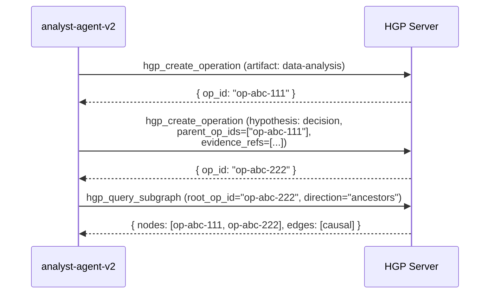
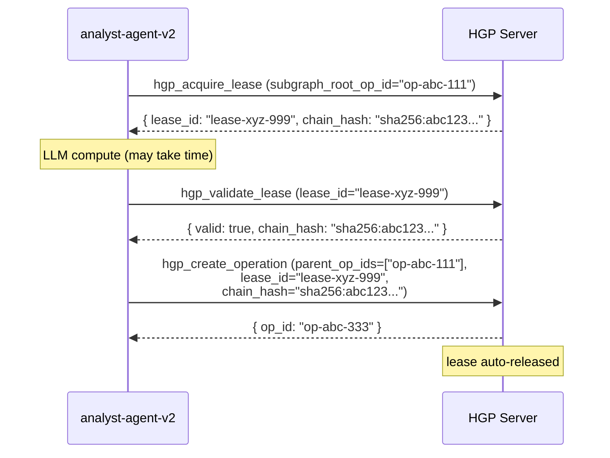
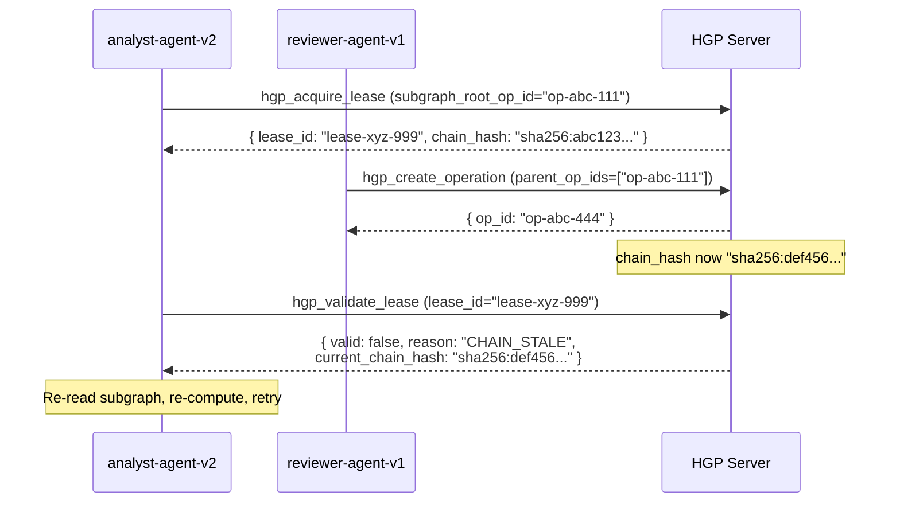
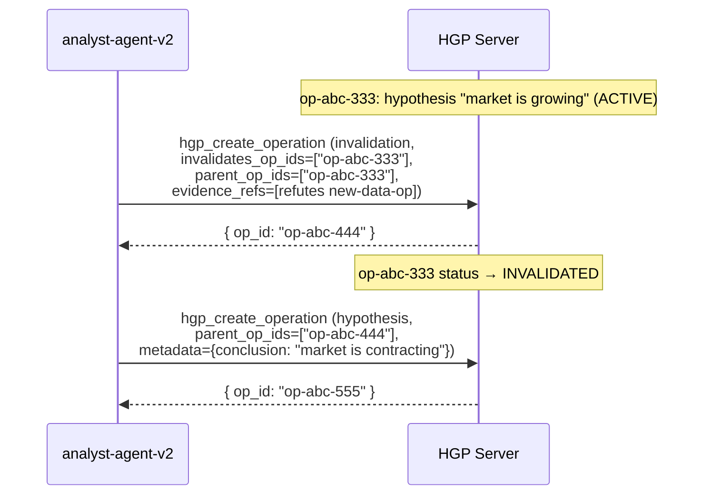
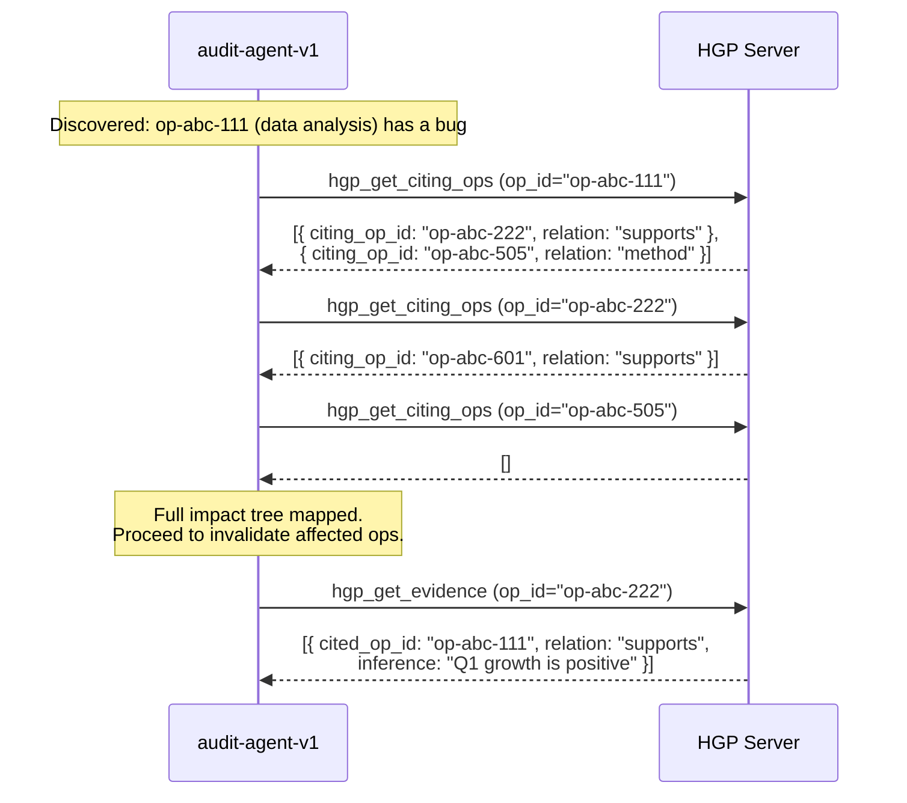

# HGP Usage Patterns

Practical recipes for common History Graph Protocol workflows.

- [README](../README.md)
- [Tools Reference](tools-reference.md)

---

## Table of Contents

1. [Pattern 1: Linear Operation Recording](#pattern-1-linear-operation-recording)
2. [Pattern 2: Multi-step Write with Lease](#pattern-2-multi-step-write-with-lease)
3. [Pattern 3: Invalidating a Prior Conclusion](#pattern-3-invalidating-a-prior-conclusion)
4. [Pattern 4: Evidence Audit Trail](#pattern-4-evidence-audit-trail)

---

## Pattern 1: Linear Operation Recording

**When to use:** An agent completes sequential tasks — data ingestion, analysis, then a conclusion — and wants to record each step with causal links and evidence citations. No other agent is writing to this subgraph concurrently, so no lease is needed. This is the simplest and most common pattern.

The causal chain is established by passing `parent_op_ids` on each subsequent operation. Evidence references (`evidence_refs`) let the hypothesis operation formally declare which prior artifacts informed its conclusion and in what way, creating a queryable audit trail without duplicating data.

### Flow



### Step-by-step Tool Calls

**Step 1 — Record the artifact (raw analysis output):**

```json
// Tool: hgp_create_operation
{
  "op_type": "artifact",
  "agent_id": "analyst-agent-v2",
  "metadata": {
    "label": "Q1 revenue analysis",
    "source_file": "q1_sales.csv",
    "row_count": 4200
  }
}
```

Response:

```json
{
  "op_id": "op-abc-111",
  "status": "ACTIVE",
  "created_at": "2026-03-25T09:00:00Z"
}
```

**Step 2 — Record the hypothesis (decision), citing the artifact as evidence:**

```json
// Tool: hgp_create_operation
{
  "op_type": "hypothesis",
  "agent_id": "analyst-agent-v2",
  "parent_op_ids": ["op-abc-111"],
  "metadata": {
    "conclusion": "Q1 growth is positive; recommend expanding the sales team"
  },
  "evidence_refs": [
    {
      "op_id": "op-abc-111",
      "relation": "supports",
      "scope": "revenue chart, rows 1-4200",
      "inference": "Aggregate revenue grew 18% YoY; all regional segments positive"
    }
  ]
}
```

Response:

```json
{
  "op_id": "op-abc-222",
  "status": "ACTIVE",
  "created_at": "2026-03-25T09:01:00Z"
}
```

**Step 3 — Verify the causal chain:**

```json
// Tool: hgp_query_subgraph
{
  "root_op_id": "op-abc-222",
  "direction": "ancestors",
  "include_invalidated": false
}
```

Response:

```json
{
  "nodes": [
    { "op_id": "op-abc-111", "op_type": "artifact", "status": "ACTIVE" },
    { "op_id": "op-abc-222", "op_type": "hypothesis", "status": "ACTIVE" }
  ],
  "edges": [
    { "from": "op-abc-111", "to": "op-abc-222", "edge_type": "causal" }
  ]
}
```

### Key Notes

- `parent_op_ids` establishes **causal** edges. An operation can have multiple parents (e.g., a merge step).
- `evidence_refs` is separate from causality — it is a semantic citation layer. An op can cite evidence from ops that are not in its direct causal ancestors.
- `relation` in `evidence_refs` must be one of: `supports`, `refutes`, `context`, `method`, `source`.
- If you omit `parent_op_ids`, the operation becomes a root node in the graph — valid for initial ingestion steps.

---

## Pattern 2: Multi-step Write with Lease

**When to use:** An agent performs a multi-step sequence (acquire data, compute, write) that must be protected against concurrent modification by another agent. Without a lease, two agents reading the same subgraph might compute independently and then race to append; the second writer's `chain_hash` will already be stale by the time it writes, causing a `CHAIN_STALE` error. Acquiring a lease makes this race condition explicit and detectable *before* the write, saving wasted LLM compute.

The lease captures the `chain_hash` of a subgraph at acquisition time. Before writing, `hgp_validate_lease` confirms the hash has not changed. On a successful `hgp_create_operation` with `lease_id`, the lease is auto-released.

### Flow — Happy Path



### Flow — CHAIN_STALE Failure Path



### Step-by-step Tool Calls

**Step 1 — Acquire the lease:**

```json
// Tool: hgp_acquire_lease
{
  "agent_id": "analyst-agent-v2",
  "subgraph_root_op_id": "op-abc-111"
}
```

Response:

```json
{
  "lease_id": "lease-xyz-999",
  "chain_hash": "sha256:abc123def456abc123def456abc123def456abc123def456abc123def456abc1",
  "acquired_at": "2026-03-25T09:10:00Z",
  "expires_at": "2026-03-25T09:40:00Z"
}
```

**Step 2 — Validate before writing (after LLM compute):**

```json
// Tool: hgp_validate_lease
{
  "lease_id": "lease-xyz-999"
}
```

Happy-path response:

```json
{
  "valid": true,
  "chain_hash": "sha256:abc123def456abc123def456abc123def456abc123def456abc123def456abc1"
}
```

Stale response:

```json
{
  "valid": false,
  "reason": "CHAIN_STALE",
  "current_chain_hash": "sha256:def456abc123def456abc123def456abc123def456abc123def456abc123def4"
}
```

**Step 3 — Write with the lease (happy path only):**

```json
// Tool: hgp_create_operation
{
  "op_type": "artifact",
  "agent_id": "analyst-agent-v2",
  "parent_op_ids": ["op-abc-111"],
  "subgraph_root_op_id": "op-abc-111",
  "lease_id": "lease-xyz-999",
  "chain_hash": "sha256:abc123def456abc123def456abc123def456abc123def456abc123def456abc1",
  "metadata": {
    "label": "Summarized report"
  }
}
```

Response:

```json
{
  "op_id": "op-abc-333",
  "status": "ACTIVE",
  "created_at": "2026-03-25T09:11:00Z"
}
```

**Step 3 (alt) — Handle CHAIN_STALE:**

```json
// 1. Re-read the updated subgraph
// Tool: hgp_query_subgraph
{
  "root_op_id": "op-abc-111",
  "direction": "descendants"
}

// 2. Acquire a fresh lease with the updated root
// Tool: hgp_acquire_lease
{
  "agent_id": "analyst-agent-v2",
  "subgraph_root_op_id": "op-abc-111"
}

// 3. Re-compute and retry from Step 2
```

### Key Notes

- Always call `hgp_validate_lease` immediately before writing — not just at acquisition time. LLM inference can take tens of seconds; the subgraph may change during that window.
- If validate returns `CHAIN_STALE`, do **not** attempt to write with the old `chain_hash`. Re-read, re-acquire, re-compute.
- Leases expire (see `expires_at`). If your compute exceeds the lease TTL, validate will return `{ valid: false, reason: "LEASE_EXPIRED" }` — treat this the same as `CHAIN_STALE`.
- If your agent crashes before writing, call `hgp_release_lease` on recovery to free the lock immediately rather than waiting for expiry.
- Passing `chain_hash` without `lease_id` is also valid for a lightweight optimistic check — the write will fail with `CHAIN_STALE` if the hash mismatches, but without the proactive validation step.

---

## Pattern 3: Invalidating a Prior Conclusion

**When to use:** An agent discovers that a previously recorded operation contains an error, an outdated assumption, or a superseded conclusion. HGP is append-only — you cannot delete or mutate an existing operation. Instead, you create an `invalidation` operation that marks the prior op as `INVALIDATED` and records the reason as evidence. A corrected conclusion is then appended as a new `hypothesis` op descending from the invalidation.

This preserves the full intellectual history: auditors can see what was believed, when it changed, and why. Queries default to `include_invalidated=false`, so invalidated ops are hidden from normal traversal while remaining permanently in the database.

### Flow



### Step-by-step Tool Calls

Assume the following already exists in the graph:

```json
// Existing operation (to be invalidated)
{
  "op_id": "op-abc-333",
  "op_type": "hypothesis",
  "agent_id": "analyst-agent-v2",
  "status": "ACTIVE",
  "metadata": { "conclusion": "market is growing" }
}

// New data operation that contradicts it
{
  "op_id": "op-abc-data-99",
  "op_type": "artifact",
  "agent_id": "data-ingest-agent-v1",
  "status": "ACTIVE",
  "metadata": { "label": "Q2 revised market data" }
}
```

**Step 1 — Create the invalidation operation:**

```json
// Tool: hgp_create_operation
{
  "op_type": "invalidation",
  "agent_id": "analyst-agent-v2",
  "parent_op_ids": ["op-abc-333"],
  "invalidates_op_ids": ["op-abc-333"],
  "metadata": {
    "reason": "Q2 revised data contradicts Q1 extrapolation"
  },
  "evidence_refs": [
    {
      "op_id": "op-abc-data-99",
      "relation": "refutes",
      "scope": "market size figures, Q2 actuals",
      "inference": "Revised Q2 data shows 12% YoY contraction across all segments"
    }
  ]
}
```

Response:

```json
{
  "op_id": "op-abc-444",
  "status": "ACTIVE",
  "invalidated_ops": ["op-abc-333"],
  "created_at": "2026-03-25T10:00:00Z"
}
```

At this point `op-abc-333` has `status: "INVALIDATED"` in the database.

**Step 2 — Append the corrected conclusion:**

```json
// Tool: hgp_create_operation
{
  "op_type": "hypothesis",
  "agent_id": "analyst-agent-v2",
  "parent_op_ids": ["op-abc-444"],
  "metadata": {
    "conclusion": "market is contracting — revised per Q2 actuals",
    "supersedes": "op-abc-333"
  },
  "evidence_refs": [
    {
      "op_id": "op-abc-data-99",
      "relation": "supports",
      "scope": "market size figures, Q2 actuals",
      "inference": "12% contraction is consistent across all segments"
    }
  ]
}
```

Response:

```json
{
  "op_id": "op-abc-555",
  "status": "ACTIVE",
  "created_at": "2026-03-25T10:01:00Z"
}
```

**Step 3 — Verify the corrected chain (invalidated op hidden by default):**

```json
// Tool: hgp_query_subgraph
{
  "root_op_id": "op-abc-555",
  "direction": "ancestors",
  "include_invalidated": false
}
```

Response:

```json
{
  "nodes": [
    { "op_id": "op-abc-444", "op_type": "invalidation", "status": "ACTIVE" },
    { "op_id": "op-abc-555", "op_type": "hypothesis", "status": "ACTIVE" }
  ],
  "edges": [
    { "from": "op-abc-444", "to": "op-abc-555", "edge_type": "causal" }
  ]
}
```

Note that `op-abc-333` does not appear. Pass `"include_invalidated": true` to expose it along with the `invalidates` edge.

### Key Notes

- `invalidates_op_ids` and `parent_op_ids` should both reference the target op. The `parent_op_ids` link maintains causal continuity; `invalidates_op_ids` is what triggers the status change.
- You can invalidate multiple ops in a single operation by listing several IDs in `invalidates_op_ids`.
- Invalidated ops are **never deleted**. They remain in the database and are retrievable with `include_invalidated=true` or direct lookup via `hgp_get_artifact`.
- The corrected hypothesis (Step 2) is not required — the invalidation alone is a valid terminal state if no replacement conclusion exists yet.
- Chains of invalidations are supported. If `op-abc-555` is later also found wrong, it can be invalidated by a new operation in the same manner.

---

## Pattern 4: Evidence Audit Trail

**When to use:** Auditing the reasoning behind a decision, or tracing the blast radius of a discovered error. HGP provides two complementary evidence traversal tools: `hgp_get_evidence` answers "what did this op rely on?", while `hgp_get_citing_ops` answers "what decisions were informed by this op?". Together they let you walk the evidence graph in either direction.

A common scenario: a data-analysis operation is found to contain a bug. Before invalidating it, you need to know which downstream decisions relied on it, so you can assess the impact and determine which conclusions also need to be invalidated or revisited.

### Flow



### Step-by-step Tool Calls

**Scenario:** `op-abc-111` (a Q1 revenue analysis artifact) is discovered to have a calculation error. We need to find every downstream decision that cited it.

**Step 1 — Find all ops that cited the buggy artifact:**

```json
// Tool: hgp_get_citing_ops
{
  "op_id": "op-abc-111"
}
```

Response:

```json
{
  "citing_ops": [
    {
      "citing_op_id": "op-abc-222",
      "relation": "supports",
      "scope": "revenue chart, rows 1-4200",
      "inference": "Q1 growth is positive; recommend expanding the sales team"
    },
    {
      "citing_op_id": "op-abc-505",
      "relation": "method",
      "scope": "aggregation logic",
      "inference": "Used same revenue aggregation for regional forecast model"
    }
  ]
}
```

**Step 2 — Recurse into each citing op to find further downstream impact:**

```json
// Tool: hgp_get_citing_ops
{
  "op_id": "op-abc-222"
}
```

Response:

```json
{
  "citing_ops": [
    {
      "citing_op_id": "op-abc-601",
      "relation": "supports",
      "inference": "Board presentation: Q1 growth justifies 20-person hiring plan"
    }
  ]
}
```

```json
// Tool: hgp_get_citing_ops
{
  "op_id": "op-abc-505"
}
```

Response:

```json
{
  "citing_ops": []
}
```

The full impact tree is now mapped:

```
op-abc-111 (buggy artifact)
├── op-abc-222 (hypothesis: "market is growing")  ← cited via "supports"
│   └── op-abc-601 (hypothesis: "approve hiring plan")  ← cited via "supports"
└── op-abc-505 (artifact: regional forecast model)  ← cited via "method"
```

**Step 3 — Inspect the evidence of a specific op (forward direction):**

```json
// Tool: hgp_get_evidence
{
  "op_id": "op-abc-222"
}
```

Response:

```json
{
  "evidence": [
    {
      "cited_op_id": "op-abc-111",
      "relation": "supports",
      "scope": "revenue chart, rows 1-4200",
      "inference": "Q1 growth is positive; recommend expanding the sales team"
    }
  ]
}
```

This confirms that `op-abc-222`'s only cited evidence is `op-abc-111` — the buggy op. It should be invalidated.

**Step 4 — Proceed with targeted invalidations in order (leaves first):**

```json
// Invalidate the leaf first (op-abc-601)
// Tool: hgp_create_operation
{
  "op_type": "invalidation",
  "agent_id": "audit-agent-v1",
  "parent_op_ids": ["op-abc-601"],
  "invalidates_op_ids": ["op-abc-601"],
  "metadata": { "reason": "Derived from buggy Q1 analysis op-abc-111" }
}

// Then invalidate op-abc-222
// Tool: hgp_create_operation
{
  "op_type": "invalidation",
  "agent_id": "audit-agent-v1",
  "parent_op_ids": ["op-abc-222"],
  "invalidates_op_ids": ["op-abc-222"],
  "metadata": { "reason": "Derived from buggy Q1 analysis op-abc-111" }
}

// Repeat for op-abc-505, and finally op-abc-111 itself
```

### Key Notes

- `hgp_get_citing_ops` only returns ops that explicitly listed the target op in their `evidence_refs`. It does **not** traverse causal edges — an op that has the target op as a `parent_op_ids` ancestor without citing it in `evidence_refs` will not appear.
- The impact tree traversal (Steps 1-2) should be done recursively until all `citing_ops` arrays are empty. Depth is bounded by your evidence graph structure.
- Invalidate in **leaf-first** order when possible. This ensures that when you query the subgraph at each step, you can observe a clean state without forward references to already-invalidated ops.
- `hgp_get_evidence` is the inverse of `hgp_get_citing_ops`: given an op, it returns the ops it cited. Use it to verify your understanding of why a specific decision was made before invalidating.
- Memory tier affects evidence traversal. Ops in `inactive` tier are excluded from default queries. If the buggy artifact was archived, call `hgp_set_memory_tier` to promote it to `short_term` or `long_term` before running the audit.
